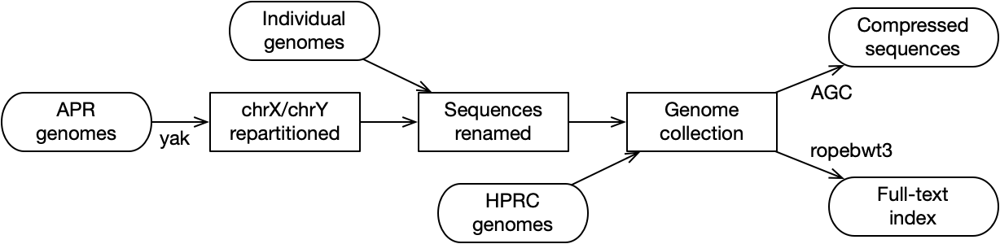

## Table of Contents

- [Introduction](#intro)
- [Downloading OpenHGL Data](#download)
- [Using OpenHGL Data](#usage)
  - [File description](#file)
  - [Retrieving genomic sequences](#getseq)
  - [Finding sequence matches](#map)
  - [More use cases](#moreuse)
- [Data Description](#data)
  - [Data sources](#src)
  - [Naming convention](#name)
  - [Known issues](#issue)
  - [ChangeLogs](#change)

## <a name="intro"></a>Introduction

The Open Human Genome Library (OpenHGL) is a collection of high-quality *de
novo* human assemblies that are publicly available in genomic databases (e.g.
[NCBI][ncbi] and [CNCB][cncb]) or from individual research papers. It provides
consistent naming and uniform formats across datasets, supporting efficient
subsequence retrieval and approximate string search.

The dataset currently consists of 579 huamn genomes with 1.7 trillion
basepairs. The full dataset is [available at AWS][aws-open] as [Open
Data][open-reg]. The primary data is also archieved [at Zenodo][zenodo].

## <a name="download"></a>Downloading OpenHGL Data

OpenHGL is available in S3 bucket `s3://openhgl`. The fastest way to download
bulk data is to use the AWS command-line interface (aws-cli), for example, with:
```sh
# list all files (there are tens of files in total)
aws s3 ls --no-sign-request --recursive s3://openhgl

# download a small sample file (24.8MB in size)
aws s3 cp --no-sign-request s3://openhgl/misc/mtb/mtb152.tar.gz .
```
If you are not familiar with aws-cli, you can [browse][aws-open] the files,
find their links and download with `wget` or `curl`. Alternatively, you can
download primary data [from Zenodo][zenodo]. However, due to limited space
provided by Zenodo, derived files (e.g. FM-index in the static format) are not
available. Downloading from Zenodo is much slower than from AWS.

## <a name="usage"></a>Using OpenHGL Data

### <a name="file"></a>File description

At present, OpenHGL provides genome sequences in the [AGC][agc] format and
the corresponding FM-index in the [ropebwt3][rb3] format:

 * `human579.agc`: [AGC][agc] archive of assembly sequences
 * `human579.fmd`: BWT in the static [ropebwt3][rb3] format (AWS only)
 * `human579.fmd.ssa`: sampled suffix array (AWS only)
 * `human579.fmd.len.gz`: contig names and lengths
 * `human579.fmr.gz`: BWT sequence in the dynamic [ropebwt3][rb3] format
 * `human579.fmd.ssa.gz`: sampled suffix array (Zenodo only)
 * `human579.meta.tsv`: metadata including 1) assembly name, 2) the sex
   chromosome in the assembly, 3) sample name, 4) 1000 Genomes Project
   population code, 5) Simons Genomes Diversity Project region code and 6)
   sample sex.

### <a name="getseq"></a>Retrieving genomic sequences

It is recommended to download precompiled AGC binary from its [release
page][agc-rel]. After copying the `agc` binary to your `PATH`, you can download
and retrieve sequences with
```sh
# download AGC archive
wget https://openhgl.s3.us-east-1.amazonaws.com/human/human579/human579.agc

# list assembly names
agc listset human579.agc

# list contig names in assembly 200125_HG02129.pat
agc listctg human579.agc 200125_HG02129.pat

# retrieve all sequences in assembly 200125_HG02129.pat
agc getctg human579.agc 200125_HG02129.pat > HG02129.pat.fa

# retrieve the first 100bp of contig HG02129#1#CM085853.1
agc getctg human579.agc HG02129#1#CM085853.1:0-99
```
**Importantly**, with AGC, the coordinate of the first base is 0. *start*-*end*
is a closed interval. This is different from common tools like `samtools faidx`
which uses closed intervals but puts the first base at coodinate 1.

### <a name="map"></a>Finding sequence matches

[Ropebwt3][rb3] is required for string search:
```sh
# install ropebwt3
git clone https://github.com/lh3/ropebwt3
cd ropebwt3; make               # add "omp=0" if you see errors

# download FM-index
wget https://openhgl.s3.us-east-1.amazonaws.com/human/human579/human579.fmd
wget https://openhgl.s3.us-east-1.amazonaws.com/human/human579/human579.fmd.ssa
wget https://openhgl.s3.us-east-1.amazonaws.com/human/human579/human579.fmd.len.gz

# exact match
echo CCAGGACCCCTGTCCAGTGTTAGACAGGAGCATGCAG | ropebwt3 mem -L human579.fmd -

# inexact match
echo CCAGGACCCCTGTCCAGTGTTAGACAGGAGCATGCAG | ropebwt3 sw -eN200 -Lm10 human579.fmd -
```

### <a name="moreuse"></a>More use cases

The following command lines show more use cases:
```sh
# Locate up to 100 exact matches
ropebwt3 mem -t16 -p100 human579.fmd seq.fa.gz > out.bed

# Find non-human sequences/contaminations
ropebwt3 mem -t16 -l101 --gap=10k human579.fmd seq.fastq.gz > out.bed

# Count 101-mers occuring over 20 times per genome on average
ropebwt3 kount -k101 -m 11580 human579.fmd > k101-20.txt
```
The [ropebwt3 paper][rb3-paper] provides additional examples.

## <a name="data"></a>Data Description

### <a name="src"></a>Data sources

| Name             | Version | nAsm | Description |
|:-----------------|:--------|-----:|:------------|
|[CHM13][chm13]    |2.0      |1     |Analysis set with HG002 chrY and rCRS chrM|
|[CN1][cn1]        |1.0.1    |2     |Chinese Han|
|[KSA001][ksa001]  |1.1.0    |2     |Saudi Arabia|
|[I002C][i002c]    |0.7      |2     |Indian|
|[KOREF1][koref1]  |2025     |2     |Korean|
|[YAO][yao]        |2.0      |2     |Chinese|
|[HPRC][hprc]      |r2-v1.0.1|464   |Human Pangenome Reference Consortium|
|[APR][apr]        |v1       |104   |UAE-based Arab Pangenome Reference|

Criteria in sample selection:

 * Publicly available, though the data use policy may vary between sources
 * Requiring PacBio HiFi for base accuracy
 * Requiring ultra-long Nanopore reads for assembly through difficult regions
 * Requiring trio or Hi-C data for chromosome-scale phasing
 * Independent samples

Additional procedure:

 * APR male samples were processed with the [yak][yak] X/Y partition pipeline
   such that Y is placed in hap1 and X in hap2. HPRC samples were processed the
   same way by the consortium.

Overview of the workflow is shown below:



### <a name="name"></a>Naming convention

A sample name matches regular expression `([0-9]{6})_([A-Z0-9]+)\.(pri|pat|mat|hap1|hap2)`.
The leading digits are a unique identifier for the contig set. The alphanumeric
string after the first underscore indicates the sample name. If the assembly of
a sample is updated, the sample name stays the same but the identifier will be
different. The ending code specifies the assembly type:

 * pri: primary assembly (for CHM13 only)
 * pat: paternal assembly from trio phasing, with chrY
 * mat: maternal assembly from trio phasing, with chrX
 * hap1: haplotype 1 from Hi-C phasing, with chrY (partitioned with [yak][yak])
 * hap2: haplotype 2 from Hi-C phasing, with chrX (partitioned with [yak][yak])

A contig name matches `([^\s#]+)#[012]#([^\s#]+)` where the first field
corresponds to the sample name and the last field to the contig or chromosome
name.  The number in the middle indicates haplotype with 0 in primary assembly,
1 for paternal or haplotype 1, and 2 for maternal or haplotype 2.

### <a name="issue"></a>Known issues

 * HG002 from HPRC and CHM13 share the same Y chromosome
 * HG00272 has a ~50Mb inversion misassembly on the X chromosome
 * NA20806 has X and Y chromosomes mispartitioned to the same haplotype
 * HG02145 has fragmented Y chromosome (see HPRC [noteworthy samples][hprc-noteworthy])

### <a name="change"></a>ChangeLogs

 * 4.0: added I002C, KOREF1 and APR; updated YAO to v2.0
 * 3.0: updated HPRC assemblies to r2-v1.0.1

[zenodo]: https://zenodo.org/records/13948741
[ncbi]: https://www.ncbi.nlm.nih.gov/
[cncb]: https://www.cncb.ac.cn/?lang=en
[aws-open]: https://openhgl.s3.us-east-1.amazonaws.com/index.html
[open-reg]: https://registry.opendata.aws
[agc]: https://github.com/refresh-bio/agc
[agc-rel]: https://github.com/refresh-bio/agc/releases
[rb3]: https://github.com/lh3/ropebwt3
[rb3-paper]: https://pubmed.ncbi.nlm.nih.gov/39607778
[chm13]: https://github.com/marbl/CHM13
[cn1]: https://www.nature.com/articles/s41422-023-00849-5
[ksa001]: https://www.nature.com/articles/s41597-024-04121-2
[i002c]: www.biorxiv.org/content/10.1101/2025.07.12.664550
[koref1]: https://www.biorxiv.org/content/10.1101/2025.11.17.688257
[yao]: https://www.biorxiv.org/content/10.1101/2025.08.01.667781
[hprc]: https://github.com/human-pangenomics/hprc_intermediate_assembly
[apr]: www.nature.com/articles/s41467-025-61645-w
[hprc-noteworthy]: https://github.com/human-pangenomics/hprc_intermediate_assembly/blob/main/data_tables/sample/noteworthy_samples.md
[yak]: https://github.com/lh3/yak
